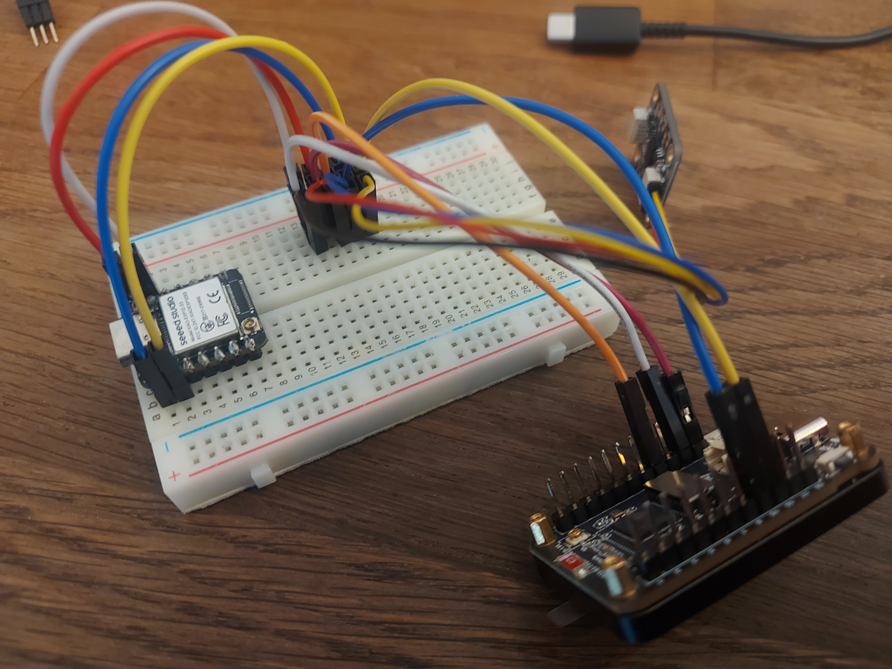
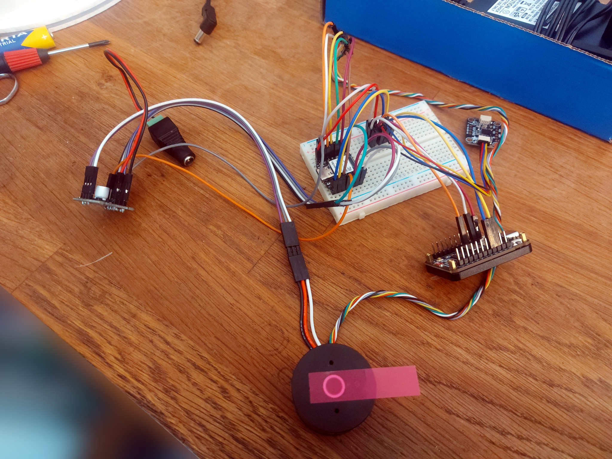

# controller (primary)

https://www.berrybase.at/waveshare-esp32-s3r8-amoled-touch-display-1-64-240mhz-280x456-16mb-flash-6-achsen-imu-3-7v
29,12 x 44
https://www.waveshare.com/ESP32-S3-Touch-AMOLED-1.64.htm

- check if ABS or another material (better than PLA) is an option

# powering (inc. schottky diode)

https://forum.seeedstudio.com/t/how-to-power-xiao-esp32s3-from-5v-vin-vbus-with-diode/281611/20
https://forum.seeedstudio.com/uploads/default/original/3X/9/0/90d52be1230af872fdc64bc6b0f88ac59e360d4d.png

https://forums.adafruit.com/viewtopic.php?t=190774

- ground of the power source to ground on the QtPy.
- (e.g. 5v) of the power source to the anode of the diode
- cathode of the diode to the 5v pin/pad on the QtPy.

# datasheets

- drv8813 :: https://www.lcsc.com/datasheet/C92482.pdf
- as5084a :: https://look.ams-osram.com/m/287d7ad97d1ca22e/original/AS5048-DS000298.pdf :: https://look.ams-osram.com/m/d6b55afbdfe4b3d0/original/AS5048_UG000223_1-00.pdf
- mpm3610 :: https://cdn-learn.adafruit.com/assets/assets/000/127/631/original/MPM3610GQV-Z.pdf?1707519066

# microcontroller pinouts

- seeed https://wiki.seeedstudio.com/xiao_esp32s3_pin_multiplexing/
- waveshare https://www.waveshare.com/ESP32-S3-Touch-AMOLED-1.64.htm
- qtpy https://cdn-learn.adafruit.com/assets/assets/000/117/412/original/adafruit_products_Adafruit_QT_Py_ESP32-S3_Pinout_updated.png?1673269364

# schleifring

botland 8.5mm :: 22€ :: https://botland.de/gleitgelenke/7146-8-adriger-schleifring-2a-85mm-5904422360016.html

# next steps

- draw arms
- think about cable management
  - check manuals of small gimbals
- find a shop that does black aluminum anodizing (prize?)

# needed evaluation

- ✔️ correct resistor values for the voltage divider need to be determined
- ✔️ powering the waveshare amoled through 5V
- ✔️powering any single device through usb
  - 〰️ puts 5V on the 12V line
  - 〰️ does not damage the stepdown converter
- 〰️ test with schottky diode :: likely works
- power switch must be OFF whenever usb is connected
  ❓would be nice to have some LED indicator for the status of the power switch
  - maybe the rotary encoder rgb-led could serve that purpose
- ✔️ availability of INPUT_PULLUP on the Waveshare switch pins, GPIO_44, GPIO_43, GPIO_45
- ✔️ functionality of waveshare secondary I2C on SDA:06 and SCL:05 :: yes, simple test with the orientation sensor worked
- ✔️ functionality of seeed secondary slace I2C SDA:01 and SCL:02
- ✔️ i2c usage in place of uart :: 
- ✔️ functionality of SPI on the pins specified in the PCB3_2 board :: 
  - white - GND
  - red - VCC
  - green - MISO:08
  - yellow - MOSI:09
  - cyan - SCK:07
  - black - CS:03
- ✔️ functionality of PWM on the pins specified in the PCB3_2 board
  ✔️ M1 :: 05
  ✔️ M2 :: 06
  ✔️ M3 :: 43
  ✔️ EN :: 44

✔️ get a feeling for the type of torque achievable with 7.4V :: appears reasonable
✔️ expose 5V and GND pins on PCB3

- ✔️ lvgl integration from platformio
- ✔️ doublecheck simplefoc / seeed pin combinations

- ❓check if there is enough memory for OTA updates on all devices
- ❓does OTA need to involve an http-server like in the Moth cCO2 sensor, or is there a simpler way?

- ✔️ power through the stepdown with ~8v
  - ✔️ at least waveshare and 1 seeed

# order

- mouser (OK)
  - adafruit power button https://www.mouser.at/de/ProductDetail/Adafruit/3104?qs=Fe2pGbCwd5c6gkNcLTXl8w%3D%3D&srsltid=AfmBOoqhgZuig5rAYAzx-hL_IUEwmz81FCs4EpL71mXRtzSOhzdhaPOD
  - Kurzhubtaster https://www.mouser.at/de/ProductDetail/Apem/ADTS31NV?qs=iGLABakYCr%252BWGqajvikDZA%3D%3D
  - JST PH 3 pin buchse https://www.mouser.at/de/ProductDetail/JST-Commercial/S3B-PH-K-SLFSN?qs=QpmGXVUTftHPTb%252BDMUkjfw%3D%3D
  - JST PH 3 pin stecker https://www.mouser.at/de/ProductDetail/JST-Commercial/PHR-3?qs=uQD7XCvsSCM92rt8vZZnwg%3D%3D
  - JST PH crimp kontakt https://www.mouser.at/de/ProductDetail/JST-Commercial/BPH-002T-P0.5S?qs=QpmGXVUTftEAmG%252BcKysqgg%3D%3D

- berrybase (OK)
  - https://www.berrybase.at/pololu-big-pushbutton-power-switch-mit-verpolungsschutz-mp
  - https://www.berrybase.at/sandisk-extreme-microsdxc-a2-uhs-i-u3-v30-170mb-s-speicherkarte-adapter-64gb
  - sd cards

- reichelt.de (OK)
  - jst ph stecker https://www.reichelt.at/at/de/shop/produkt/jst_-_stiftleiste_gerade_1x4-polig_-_ph-185051
  - (jst ph crimpkontakte https://www.reichelt.at/at/de/shop/produkt/jst_-_crimpkontakt_buchse_-_ph-185071)
  - kondensator https://www.reichelt.at/at/de/shop/produkt/elko_radial_100_f_35v_rm2_5_1000h_105_c_20_-42401
  - battery holders 18650
  - battery 18650

- iFlight (OK)
  - 3 GM3506 motors (✔️ see if it works OK with the simplefoc board (assume it will then also work with the PCB3_3 board))

- digikey (OK)
  - kurzhubtaster https://www.digikey.at/en/products/detail/te-connectivity-alcoswitch-switches/1825910-6/1632536
  - kurzhubtaster https://www.digikey.at/en/products/detail/te-connectivity-alcoswitch-switches/1-1825910-4/1632539
  - mini joystick https://www.digikey.at/de/products/detail/adafruit-industries-llc/2765/6193582
  - jst ph extension cable 4 pin https://www.digikey.at/en/products/detail/adafruit-industries-llc/3568/7672337
  - jst ph extension cable 2 pin https://www.digikey.at/de/products/detail/adafruit-industries-llc/4714/13175532
  - rotary encoder https://www.digikey.at/de/products/detail/adafruit-industries-llc/5880/22596384

- reichelt.de (OK)
  - 4 battery holders https://www.reichelt.at/at/de/shop/produkt/batteriehalter_fuer_1_18350-213365
  - 3 seeed xiao https://www.reichelt.at/at/de/shop/produkt/xiao_esp32s3_dual-core_wifi_bt5_0_ohne_header-358354
  - 2 5.5v buchse https://www.reichelt.at/at/de/shop/produkt/steckverbinder_dc_buchse_zum_einbau-259482
  - 2 mini switch https://www.reichelt.at/at/de/shop/produkt/miniatur-kippschalter_ein-aus_3_a_125_v-359360
  - 2 sd karte https://www.reichelt.at/at/de/shop/produkt/microsdhc-speicherkarte_4gb_intenso-83730
  - 5 shottky dioden https://www.reichelt.at/at/de/shop/produkt/schottkydiode_40_v_1_a_do-41-219559
  - 1 widerstände https://www.reichelt.at/at/de/shop/produkt/sortiment_e12-widerstaende_610-teilig-119272
  - ??? (reichelt)

- akkushop.de (OK)
  - battery (akkushop.de) :: https://www.akkuteile.de/samsung-inr18650-29e_100621_1222
  - BMS (akkushop.de) :: 30.9 x 7.9 :: https://www.akkuteile.de/schutzelektronik/s2-bms/2s-pcb-keeppower-2s-0830-schutzelektronik_200504_1410
  - ladegerät 8.4V (akkushop.de) :: https://www.akkuteile.de/fuyuang-enerpower-2s-8-4v-7-2v-17w-cccv-li-ion-ladegeraet-2a-mit-dc-plug-5-5mm-2-1mm_400613_2379

# encoder cables

- white - GND
- red - VCC
- green - MISO
- yellow - MOSI
- cyan - SCK
- black - CS

other end

- white - GND
- red - VCC
- black - CS
- yellow - MOSI
- green - MISO
- cyan- SCK

https://community.simplefoc.com/t/ipower-motor-and-spi-wiring/323/17

# sensor

MagneticSensorSPI sensor = MagneticSensorSPI(AS5048_SPI, GPIO_NUM_6);

# driver

BLDCDriverI2C3PWM driver = BLDCDriverI2C3PWM(1, 2, 3, 0);

# motor

BLDCMotor motor = BLDCMotor(7, 4.5f, 230.0f); // 9Ω / 2 // , 0.001f // TODO impedance test script
